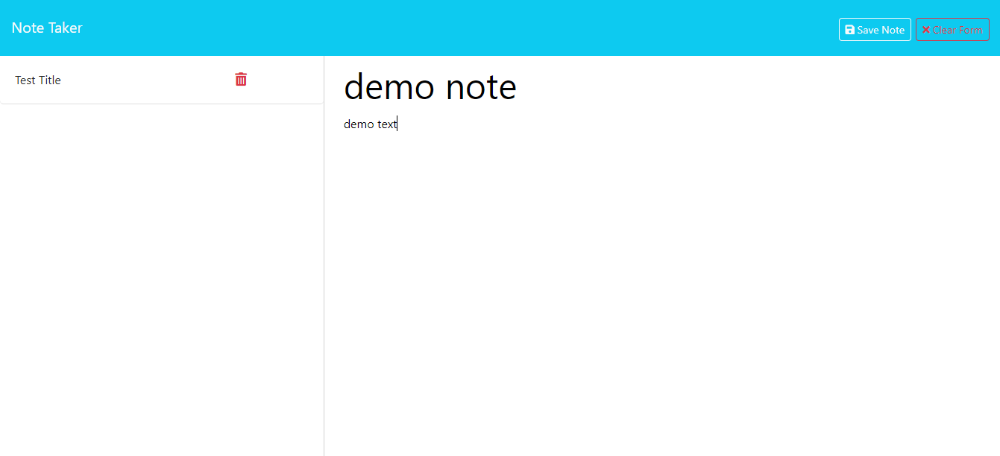

# Express Notes 11

  ## Table of Contents
- [Description](#description) 
- [Usage](#usage)
- [Credits](#credits)
- [License](#license)
- [Contributing](#contributing)
- [Tests](#tests)
- [Questions](#questions)

## Description 
The Express Notes 11 app was created to provide a website that can keep track of notes, giving you the ability to create and delete notes. The project was developed with the intention of exploring the back end portion of a project. In this instance, an express server was created to provide accesible web routes and to provide dynamic content that is saved to a json database. If you're like me and forget what day you're living in, a note managing application can help you stay focused and productive. The delete route was learned through the project, allowing a site visitor to delete notes when they are no longer needed. Other concepts learned were the readFileSync and WriteFileSync methods to ensure proper content display, and the use of [ShortUniqueID](https://www.npmjs.com/package/short-unique-id) to give notes an id property.

## Usage
**Usage Image:**

**Deployed App Link:** https://rocky-inlet-85078-68dbce430e30.herokuapp.com/

Click the link to the deployed application above to start using the app. When you get to the homepage click **Get Started** to enter the notes page. Once in the notes page, you can create notes and save them to your list using the save button in the top right. If you wish to delete a note you can click on the trash can icon to delete the note from your saved list. Your saved notes are written to a json database file for persistence so if you need to reload the page, your notes are saved. 

## Credits
Original Starter code from: https://github.com/coding-boot-camp/miniature-eureka

Referenced Repo used to understand the backend and develop the server.js: https://github.com/nramirez686/instantNotes
## License
License: MIT

## Contributing 
Go to the Questions section for more info.

## Tests 
No tests at this time.

## Questions 
If you have questions regarding the app, you can reach out to my github or email.

GitHub: https://github.com/Kanabaki

Email: kagomekanabaki@gmail.com

-Note- Some code for the server.js file was developed under Sub TA Mark Alfano and Tutoring Instructor Michell Brito with the troubleshooting of the notes post route. In addition to the post route was the delete route that was also developed under guidance of Michell Brito-Note-